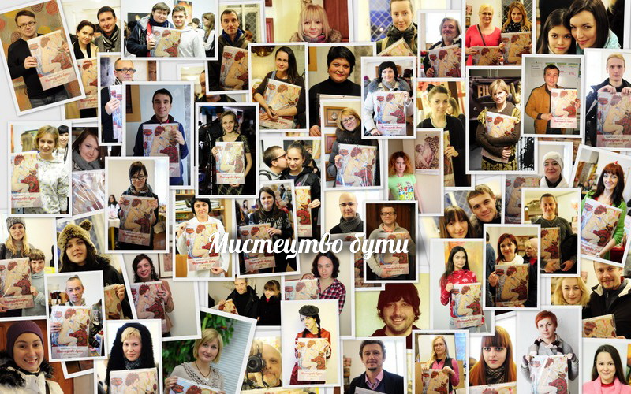
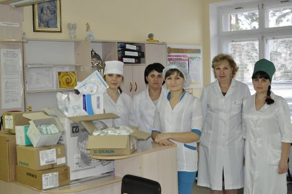

Коли ми разом - ми багато чого можемо. Ми відчуваємо, що зробили добру справу, що рік прожитий не дарма! З наступаючим Вам улюблені мої Друзі!  

Гроші від продажу календаря йдуть на благодійність в Центр дитячої онкології та гематології при онко лікарні м. Черкаси


<picture class="w-full">
    <source type="image/avif" srcset="volonteers.avif">
    <source type="image/webp" srcset="volonteers.webp">
    
</picture>




## Благодійний календар. Підсумок


<picture class="w-full">
    <source type="image/avif" srcset="2013-02-05-oncobolnica.avif">
    <source type="image/webp" srcset="2013-02-05-oncobolnica.webp">
    
</picture>


Each person shared their kindness and energy. I saw in people a desire to help, an openness and kindness, they donated money for the children and received from me a small keepsake in the form of a calendar.  
Not only Cherkassy residents took part in the action, but we were also supported by residents of more than 20 cities - Mariupol, Shostka, Kherson, Dnepropetrovsk region, Kiev, Donetsk, Zolotonosha, Zhitomir, Sevastopol, Zaporozhye, Smela, Kirovograd, Kharkov, Rivne, Lvov.  
The calendars were scattered around the world to Germany, Mexico, Russia, and Canada.
We collected 13 thousand UAH. We ordered the drugs and they were brought from Kyiv. Some of them are very rare and necessary. My good friend Andrey Gonchar and I picked up and transferred the drugs to the children's department of oncology and hematology in Cherkassy.  
Irina Yuryevna (head of the department) and I imagined how much stronger the possibility of transferring energy for the recovery of children would be. If only it were possible to collect energy and use it to heal


