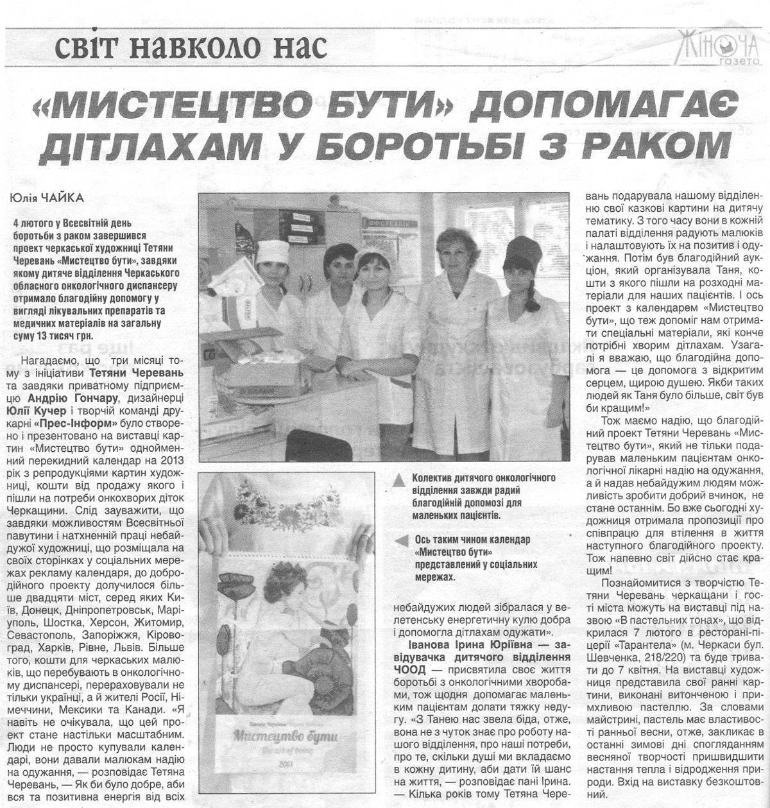



    <picture class="hidden sm:block w-full">
        <source type="image/avif" srcset="2013-02-13-women-newspaper.avif">
        <source type="image/webp" srcset="2013-02-13-women-newspaper.webp">
        
    </picture>



4 лютого у Всесвітній день боротьби з раком завершився проект черкаської художниці Тетяни Черевань «Мистецтво бути», завдяки якому дитяче відділення Черкаського обласного онкологічного диспансеру отримало благодійну допомогу у вигляді лікувальних препаратів та медичних матеріалів на загальну суму 13 тисяч грн. 
Нагадаємо, що три місяці тому з ініціативи Тетяни Черевань та завдяки приватному підприємцю Андрію Гончару, дизайнеру Юлії Кучер та творчій команді типографії «Прес-Інформ» було створено і презентовано на виставці картин «Мистецтво бути» однойменний перекидний календар на 2013 рік з репродукціями картин художниці, кошти від продажу якого і пішли на потреби онкохворих діток Черкащини. Слід зауважити, що завдяки можливостям Всесвітньої павутини і натхненій праці небайдужої художниці, що розміщала на своїх сторінках в соціальних мережах рекламу календаря, до добродійного проекту долучилися більше двадцяти міст, серед яких Київ, Донецк, Дніпропетровськ, Маріуполь, Шостка, Херсон, Житомир, Севастополь, Запоріжжя, Кіровоград, Харків, Рівне, Львів. Більше того кошти для черкаських малюків, що перебувають в онкологічному диспансері, перераховували не тільки українці, а й жителі Росії, Германії, Мексики та Канади. «Я навіть не очікувала, що цей проект стане настільки масштабним. Люди не просто купували календарі, вони давали малюкам надію на одужання, - розповідає Тетяна Черевань, - Як би було добре аби вся та позитивна енергія від всіх небайдужих людей зібралася в велетенську енергетичну кулю добра і допомогла дітлахам одужати».

Іванова Ірина Юріївна - завідуюча дитячим відділенням ЧООД присвятила своє життя боротьбі з онкологічними хворобами, тож щодня допомагає маленьким пацієнтам справлятися з тяжкою недугою. «З Танею нас звела біда, отже вона не з чуток знає про роботу нашого відділення, про наші потреби, про те скільки душі ми вкладаємо в кожну дитину аби дати їй шанс на життя, - розповідає пані Ірина. – Кілька років тому Тетяна Черевань подарувала нашому відділенню свої картини на дитячу тематику, тож з того часу у нас в кожній палаті відділення розташовані казкові картини, які радують малюків і настроюють їх на позитив і одужання. Потім був благодійний аукціон, який організувала Таня, кошти з якого пішли на розходні матеріали для наших пацієнтів. І ось проект з календарем «Мистецтво бути», що теж допоміг нам отримати спеціальні матеріали, які конче потрібні хворим дітлахам. Взагалі я вважаю, що благодійна допомога – це допомога з відкритим серцем, щирою душею. Якби таких людей як Таня було б більше, світ був би кращим!»
Маємо надію, що благодійний проект Тетяни Черевань «Мистецтво бути», який не тільки подарував маленьким пацієнтам онкологічної лікарні надію на одужання, а й надав небайдужим людям можливість зробити добрий вчинок, не стане останнім. Адже вже сьогодні художниця отримала пропозиції про співпрацю для втілення в життя наступного благодійного проекту. Тож напевно світ дійсно стає кращим!
Познайомитися з творчістю Тетяни Черевань черкащани і гості міста можуть на виставці під назвою «В пастельних тонах», що відкрилася 07 лютого в ресторані-піцерії «Тарантела» (м. Черкаси бул. Шевченка, 218/220) та буде тривати до 07 квітня. На виставці художниця представила свої ранні картини, виконані витонченою і примхливою пастеллю, що за словами майстрині має властивості ранньої весни, отже закликає в останні зимові дні спогляданням весняної творчості пришвидшити настання тепла і відродження природи.



Юлія Чайка


