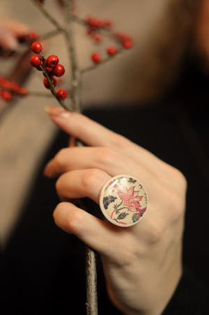


<picture class="hidden sm:block w-full">
    <source type="image/avif" srcset="jewelry-with-marianna-stepanenko.avif">
    <source type="image/webp" srcset="jewelry-with-marianna-stepanenko.webp">
    
</picture>


В этом году я с Марианной Степаненко выпустила две серии украшений. 

Первая была создана для мероприятия "Ночь в музее", вторая презентована на открытии моей персональной выставки "Искусство Быть"

Мы кропотливо выбирали фрагменты из моих работ, подбирали бусины, выбирали цвет метала, цвет пластика.

В дальнейшем будет изготовлена новая серия на основе бронзовых  креплений. 


