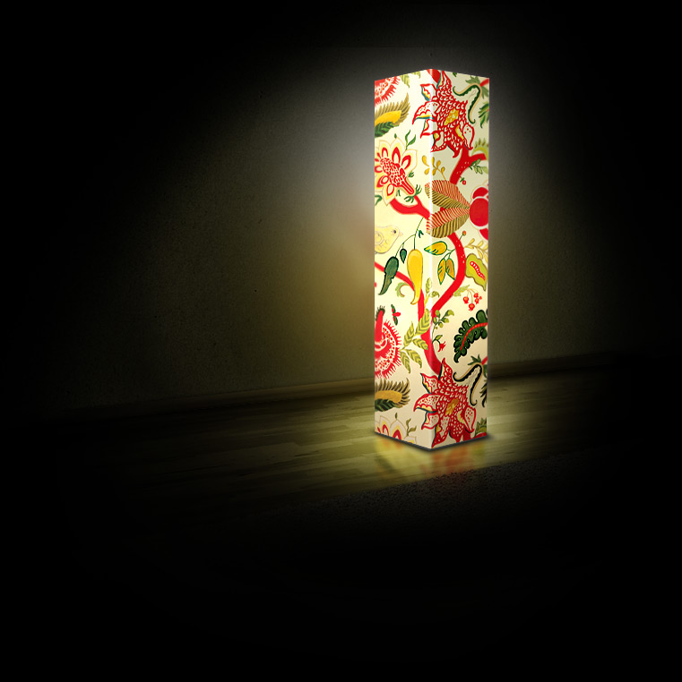


<picture class="hidden sm:block w-full sm:w-1/2">
    <source type="image/avif" srcset="night-lamp.avif">
    <source type="image/webp" srcset="night-lamp.webp">
    
</picture>

Светильник изготовлен на основе репродукции картины, художницы Татьяны Черевань 
Утонченные линии плавно меняются, кружатся и танцуют, завораживая зрителя своей красотой.

Плафон светильника изготовлен из пластика с нанесением на поверхность полноцветного изображения, защищенного от царапин. Изображение защищено от царапин ламинатом.

В светильнике используется энергосберегающая лампа, мощностью до 26W, цоколь - Е27.Категорически запрещено использовать в светильнике, лампы накаливания и прочие нагревающиеся источники света.

Светильник выпускается в трех размерах:

Светильник напольный большой (1200х250х250мм)

Светильник напольный средний (960х200х200мм)

Светильник настольный (500х150х150мм)



